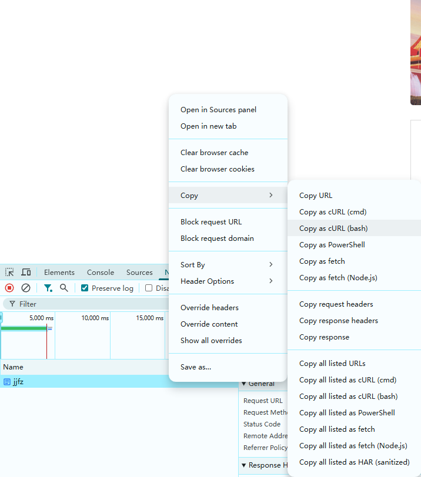
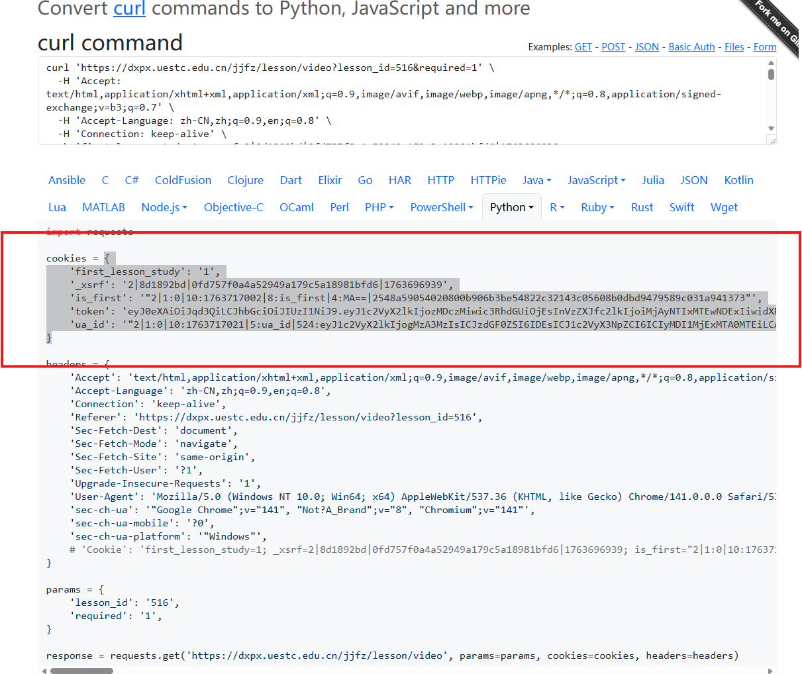
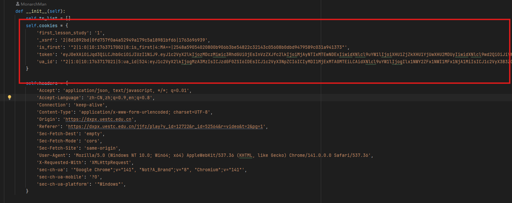

# 电子科技大学（UESTC）积极分子培训视频刷课脚本
## All you need is a Python script!
2025.11.21 经过测试，脚本顺利运行，并完成所有课程的观看任务。后续会考虑加入发展对相关视频的支持。 

## 使用方法
### 1. 安装依赖
通常情况下编译器已经预装了所需依赖，如`requests`等。如果未安装，请根据提示安装。
### 2. 修改Cookies
#### 2.1 复制请求
登录自己的积极分子账号后，打开浏览器开发者工具（如Chrome的F12或Edge的F12），切换到Network（网络）标签页。
刷新页面，找到第一个请求，复制其Cookies值。 
如果你不会操作，以谷歌浏览器为例，右键第一个请求，选择“Copy"，再点击"Copy as cURL"。 
 
#### 2.2 转换为Python代码
之后，转到网站：(https://curlconverter.com/python/)
，将复制的cURL命令粘贴到网站中。将生成的Python代码（选中部分）复制到脚本中。 
 
#### 2.3 修改jjfz,py脚本Cookies
将刚刚复制的cookies代码替换到脚本的self.cookies中，即图中红框里的大括号部分。 
 
#### 2.4 运行jjfz.py脚本，坐等完成
在pycharm或者其他python编辑器中运行jjfz.py脚本，也可以在命令行中运行，坐等完成。

## 运行效果
截至到测试时间，脚本顺利运行，并完成所有课程的观看任务。 

## 注意事项
1. 请确保自己的积极分子账号已登录，且Cookies值已正确复制到脚本中。
2. 脚本运行完成后，会在控制台输出完成信息。
3. **本项目仅供技术学习交流,为此引出的任何与技术无关的问题与作者本人无关**
