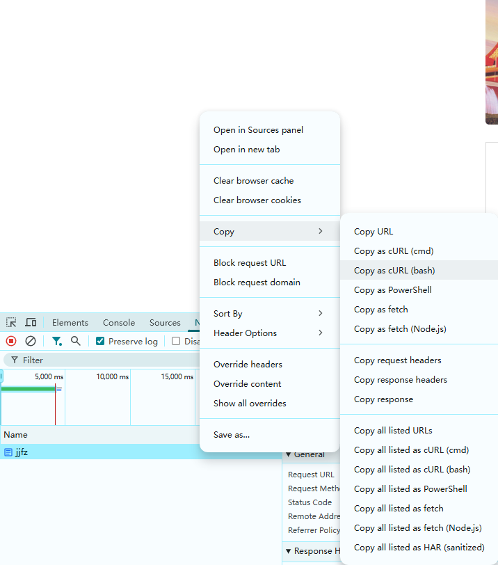
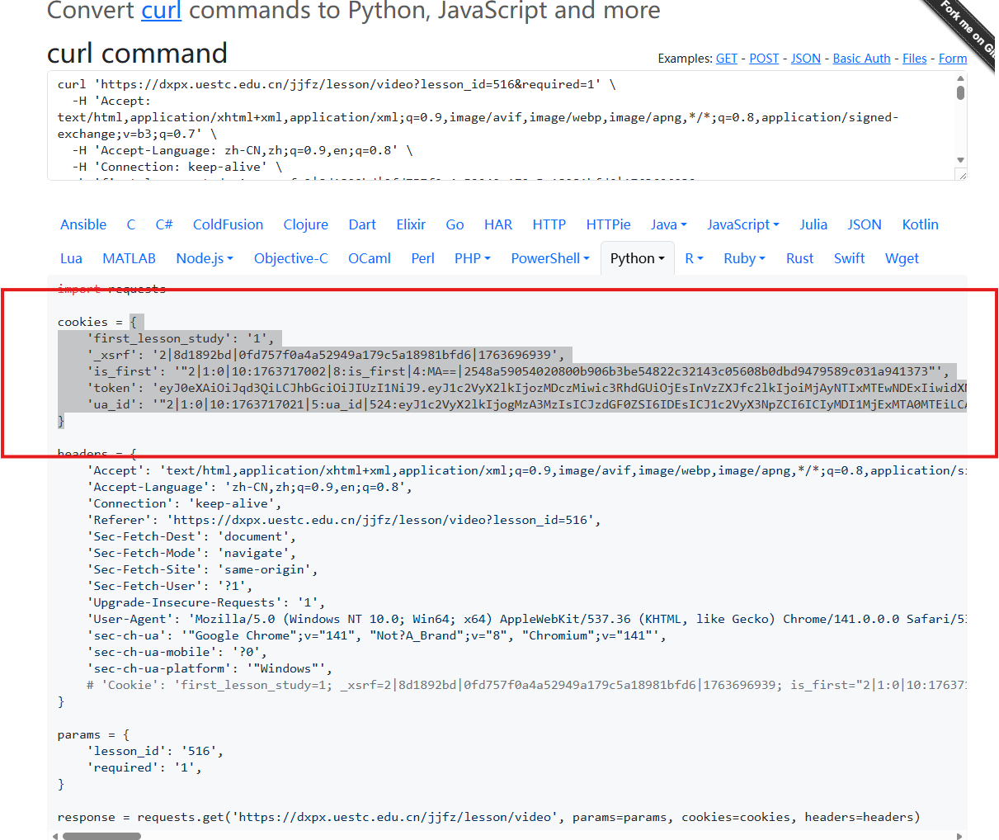

# 电子科技大学（UESTC）积极分子培训脚本
## All you need is a Python script!
2025.11.21 经过测试，脚本顺利运行，并完成所有课程的观看任务。后续会考虑加入发展对象相关的支持。<br>
2026.05.20 对本期积极分子课程再次进行测试，顺利完成所有任务。<br>
2026.06.01 增加发展对象的视频课程、考试支持，并完成测试。<br>
2026.06.10 调整 jjfz.py 命令：--init 只采集课程信息不再自动提交；新增 --submit LESSON_ID / --all 走两步法（/jjfz/lesson/video 拿 v_id 种子 → /jjfz/play 拿完整对）实际提交观看记录。<br>

## 使用方法
### 1. 安装依赖
通常情况下编译器已经预装了所需依赖，如`requests`、`pandas`、`pypinyin`等。如果未安装，请根据提示安装。

### 2. 修改 Cookies
#### 2.1 复制请求
登录自己的积极分子账号后，打开浏览器开发者工具（如Chrome的F12或Edge的F12），切换到Network（网络）标签页。
刷新页面，找到第一个请求，复制其Cookies值。<br>
如果你不会操作，以谷歌浏览器为例，右键第一个请求，选择“Copy"，再点击"Copy as cURL"。<br>
<br>
#### 2.2 转换为JSON代码
之后，转到网站：(https://curlconverter.com/json/)
，将复制的cURL命令粘贴到网站中。将生成的JSON代码（选中部分）复制。<br>
<br>
#### 2.3 保存到 cookies.json
将刚刚复制的 cookies 字段保存到项目根目录的 `cookies.json` 中。

> 如果不想用默认路径 `cookies.json`，可以通过 `--cookies-file` 指定其他位置：
> ```bash
> python dxpx/jjfz/jjfz.py --init --cookies-file /path/to/your/cookies.json
> ```
> 这样就**不需要**再手动改任何脚本里的代码了。

#### 2.4 运行脚本
所有命令都建议在项目根目录运行，也就是本 `readme.md` 所在目录。

### 3. 积极分子（jjfz）
#### 3.1 初始化课程信息
获取课程信息并保存到默认目录：
```bash
python dxpx\jjfz\jjfz.py --init
```

指定课程信息保存目录：
```bash
python dxpx\jjfz\jjfz.py --init --output-dir dxpx/jjfz/temp
```

> `--init` 只**采集**课程信息（走两步法：`/jjfz/lesson/video` 拿 v_id 种子 → `/jjfz/play` 拿完整的 `(video_id, resource_id)` 对），并保存到 `lessons.json`。
> **不会**自动提交观看记录——提交走 3.4。

#### 3.2 更新本地题库
从已完成的综合考试和章节测试记录中抓取题目，去重后更新本地题库：
```bash
python dxpx\jjfz\jjfz.py --update
```

#### 3.3 自动完成考试
综合提升考试，默认模式为 `end`：
```bash
python dxpx\jjfz\exam.py --mode end --echos 30
```

章节测试：
```bash
python dxpx\jjfz\exam.py --mode lesson --echos 30
```

`--echos` 表示循环执行次数，可根据需要调整。

#### 3.4 提交观看记录
仅提交指定 lesson：
```bash
python dxpx\jjfz\jjfz.py --submit 567
```

提交所有 lesson（`--submit` 和 `--all` 互斥）：
```bash
python dxpx\jjfz\jjfz.py --all
```

与 `--init` 联动使用：
```bash
python dxpx\jjfz\jjfz.py --init           # 1. 先采集保存
python dxpx\jjfz\jjfz.py --all            # 2. 再批量提交
```

`--all` 适用于中途中断后重跑某个 lesson，其余 lesson 不会重复提交。

### 4. 发展对象（fzdx）
#### 4.1 初始化课程信息
获取课程信息并保存到默认目录：
```bash
python dxpx\fzdx\fzdx.py --init
```

指定课程信息保存目录：
```bash
python dxpx\fzdx\fzdx.py --init --output-dir dxpx/fzdx/temp
```

#### 4.2 更新本地题库
从已完成的考试记录中抓取题目，去重后更新本地题库：
```bash
python dxpx\fzdx\fzdx.py --update
```

#### 4.3 自动完成考试
```bash
python dxpx\fzdx\exam.py --echos 10
```

`--echos` 表示循环执行次数，可根据需要调整。

## 主要功能
### 1. 视频刷课
积极分子走两步：
1. `python dxpx\jjfz\jjfz.py --init` —— 采集课程信息并保存到 `lessons.json`（不提交）
2. `python dxpx\jjfz\jjfz.py --all` 或 `--submit LESSON_ID` —— 实际提交观看记录

发展对象（fzdx）的 `--init` 仍保持原有行为（采集+提交一体）。

### 2. 章节测试刷题
积极分子脚本支持章节测试，运行：
```bash
python dxpx\jjfz\exam.py --mode lesson --echos 30
```

### 3. 综合考试刷题
积极分子综合考试：
```bash
python dxpx\jjfz\exam.py --mode end --echos 30
```

发展对象考试：
```bash
python dxpx\fzdx\exam.py --echos 10
```

### 4. 获取系统题库
建议先运行十次以上自动刷题，以在系统上留下考试记录。脚本会通过查询考试记录，获取所有考题，然后去重、按拼音排序、分类（单选、多选、判断、填空）。<br>
更新题库可以直接运行：<br>
**积极分子：**
```bash
python dxpx\jjfz\jjfz.py --update
```
**发展对象：**
```bash
python dxpx\fzdx\fzdx.py --update
```

## 运行效果
### 1. 视频刷课
截至到测试时间，脚本顺利运行，并完成所有课程的观看任务。<br>

### 2. 章节测试刷题
截至到测试时间，脚本顺利运行，并完成所有章节测试。<br>


## 其他脚本
[研究生英语-学堂在线刷题脚本](mooc/english.py)，题目和答案见[研究生英语-学堂在线题库](doc/mooc/english.txt)。

## 注意事项
1. 请确保自己的积极分子账号已登录，且 `cookies.json` 中的值已正确更新。`_xsrf` 字段必填，缺了启动时会报错。
2. 脚本运行完成后，会在控制台输出完成信息。
3. 使用刷题功能时，由于做题时系统给出的题目中空格等符号的数量可能与本地题库不一致，导致判断错题的逻辑错误，但是会保证你能得到不错的分数。
4. **本项目仅供技术学习交流,为此引出的任何与技术无关的问题与作者本人无关**
